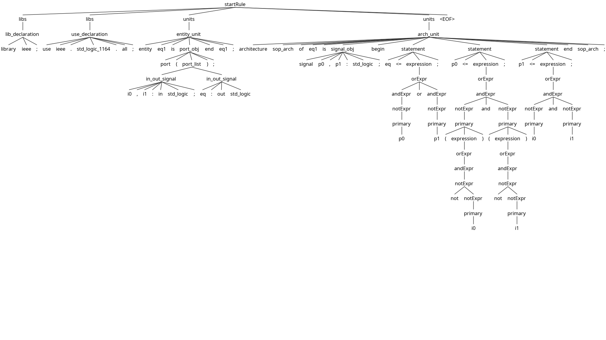

Packages:
```
sudo pacman -S antlr4 python-antlr4
```

Preparation:
```
antlr4 -Dlanguage=Python3 VHDLLexer.g4 VHDLParser.g4
```

lexer und parser im Terminal
```
python main.py beispiel_vhdl.vhd
```

Ableitungsbaum:
```
./launch.sh
```

Protokoll:

Für die Aufgabe 2 habe ich mir eine Untermenge der VHDL Sprache ausgesucht. Ziel war es, dass dieses [Beispiel Program](https://github.com/Herbert-Haase/ain_programs/blob/main/ain5/spko/02/beispiel_vhdl.vhd) und ähnliche Code Snippets geparsed werden können.

## Vorbereitung und Lexer-Implementierung
Zunächst wurde ein bestehendes XML-Beispiel erfolgreich ausgeführt und als Basisstruktur für das eigene VHDL-Projekt adaptiert. Viele Token-Definitionen im Lexer waren intuitiv verständlich, andere wiederum erforderten eine tiefere Auseinandersetzung mit der ANTLR4-Mechanik. Ein Beispiel hierfür ist

```
CDATA : '<![CDATA[' .*? ']]>' ;
```

Ein weiteres komplexeres Konstrukt war die Arbeit mit lexikalischen Modi:

```
SPECIAL_OPEN : '<?' Name -> more, pushMode(PROC_INSTR) ;
```
Hierbei wird durch das Pushen und spätere Poppen (pushMode/popMode) ein neuer Kontext auf den Stack gelegt, wodurch das Token über verschiedene Analysephasen hinweg erweitert wird.

## Handhabung der Case-Insensitivity in VHDL
Da VHDL eine case-insensitive Sprache ist, ergaben sich für die Umsetzung in der VHDLLexer.g4 mehrere Lösungsansätze:

Option 1: Direkte Definition in der Regel: 
```
ENTITY : [eE][nN][tT][iI][tT][yY];
```

Option 2: Auslagerung in Fragmente:
```
Code snippet
fragment E : [eE];
fragment N : [nN];
// ...
ENTITY : E N T I T Y;
```

Option 3: Nutzung der ANTLR4-Option: 

```
options { caseInsensitive = true; }
```

Die Entscheidung fiel auf die dritte Option, da diese ab ANTLR-Version 4.11 nativ unterstützt wird und den saubersten Code liefert.
Die Definition sämtlicher Nicht-Identifier-Zeichen und Operatoren stellte sich im Anschluss aufgrund der schieren Menge an benötigten Token als sehr repetitiv und zeitaufwendig heraus.

## Parser und Regelstruktur
Beim Entwurf des Parsers bestand der erste Schritt in der groben Strukturierung der Grammatik. Aufgrund des überschaubaren Sprachumfangs ergab sich folgende Basisstruktur als Einstiegspunkt:
```
Entrypoint -> (USE | LIBS)* (ENTITY | ARCHITECTURE)+ EOF
```

Anschließend wurden diese Hauptkomponenten systematisch in ihre jeweiligen Unterregeln (Bausteine) zerlegt. Die interessanteste und komplexeste Regel war dabei das statement, welches in Zuweisungen (assignment) und Ausdrücke (expression) untergliedert wurde.

## Auflösung von Ausdrücken (Expressions) und Operator-Prioritäten
Die expression-Regeln wurden in verschiedene Typen ausdifferenziert. Die größte Herausforderung bestand in der Einhaltung der korrekten Operator-Prioritäten (Operator Precedence).

Hierfür wurde eine kaskadierende, hierarchische Struktur implementiert:
Regeln niedrigerer Priorität rufen schrittweise die Regeln der nächsthöheren Priorität auf. Dies geschieht, bis der am höchsten priorisierte Operator den primitiven Wert (z. B. ein Literal) erreicht. Diese Grammatikstruktur führt beim Parsen konzeptionell zu einer Kaskade von Stack-Aufrufen. Beim Verlassen der Regeln (Pop) wird sichergestellt, dass alle Operatoren in der semantisch korrekten Reihenfolge ausgewertet werden.

Diese Verschachtelung führte letztendlich dazu, dass der resultierende Ableitungsbaum (Parse Tree) für die statement-Regel der größte und visuell anschaulichste Bereich des Baums wurde.


